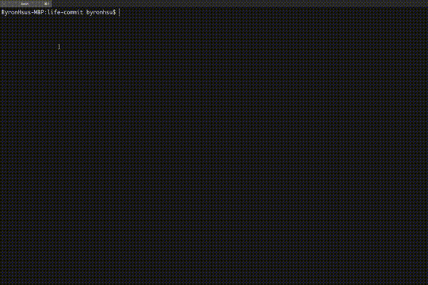
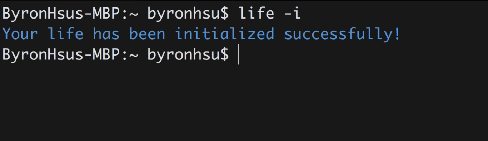
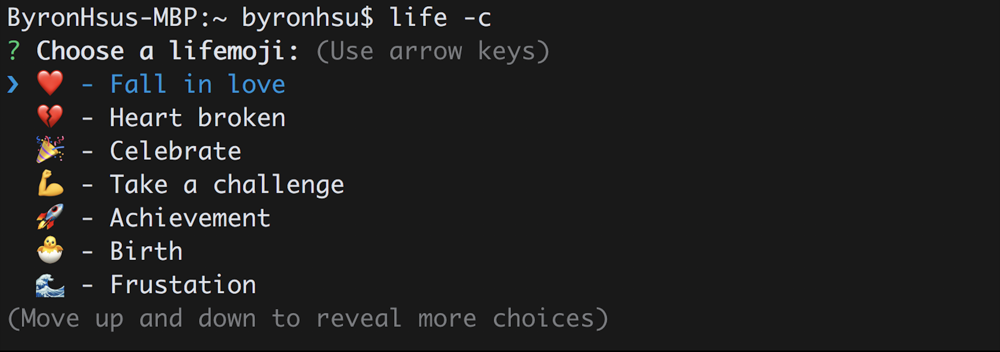
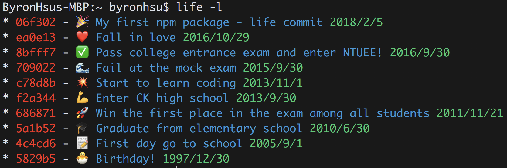
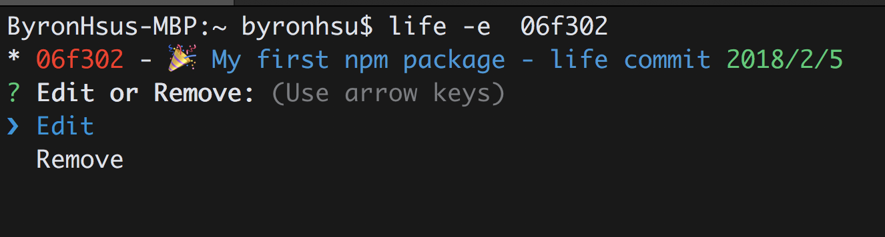

<p align="center">

</p>

<p align=center>
<a target="_blank" href="https://npmjs.org/package/nba-go" title="NPM version"></a>
<a target="_blank" href="http://nodejs.org/download/" title="Node version"></a>
<a target="_blank" href="https://opensource.org/licenses/MIT" title="License: MIT"></a>
<a target="_blank" href="http://makeapullrequest.com" title="PRs Welcome"></a>
</p>  


> 🏃📆 Life as a git. Commit on your life.

## Demo

<p align="center">

</p>

### My Website

https://byronhsu.github.io/life-commit/

## Install
In order to use life-commit, make sure that you have Node version 6.0.0 or higher.

```
$ npm install -g life-commit
```

## Usage

### overview
```
  Usage
    $ life
  Options
    --init, -i                 
    --commit, -c               
    --log, -l                  
    --edit , -e <commitId>      
    --dir, -d [folder name]    
  Examples
    $ life --commit
    $ life --log
```
### options

#### ``--init`` or ``-i``
```
$ life --init
```
Initialize your life



#### ``--commit`` or ``-c``
```
$ life --commit
```
Commit on your life



#### ``--log`` or ``-l``
```
$ life --log
```
Log the commits on your life 



#### ``--edit`` or ``-e``
```
$ life --edit 06f302
```
Edit the existing commits



#### ``--dir`` or ``-d``
```
$ life --dir myfolder
```
Create a directory that visualizing the commits on webpage      


## Contribute
- Define lifemojis

  All the lifemojis are stored at ``/src/data/lifemojis.json``. Open an issue that contains an **emoji** and **description**. Let's brainstorm and define more and more creative lifemojis together!
  
  Example:
  ```js
    {
    "emoji": "🚚",
    "description": "Made a move"
    },
    {
    "emoji": "👰",
    "description": "Got married"
    },
    {
    "emoji": "👨‍👩‍👧",
    "description": "Had a child"
    },
  ```

## Credits

[Elegant UI design by Bruno Rodrigues](https://codepen.io/itbruno/pen/KwarLp)

Creative project [gitmoji-cli](https://github.com/carloscuesta/gitmoji-cli) and [gitmoji](https://github.com/carloscuesta/gitmoji) by [Carlos Cuesta](https://github.com/carloscuesta)

LOGO desinged by [Gary Chiang](https://www.facebook.com/gary8621)